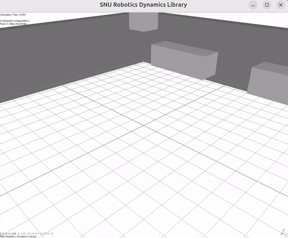

# srLib

**srLib** is a simulation library for rigid multi-body dynamics, developed at [Robotics Lab](https://sites.google.com/robotics.snu.ac.kr/fcp/) in [Seoul National University](http://www.snu.ac.kr/). Thanks to its flexibility, various modern robot platforms can be modeled and simulated using this library without any deep knowledge of dynamics. Primitive geometries, joints, actuation method, and sensors are included.

Visit the [website](http://robotics.snu.ac.kr/srlib/) of srLib for more information.

## Build & Run (pixi)

- Requirements: [pixi](https://pixi.sh) installed.
- Configure/build (Release, OSG on): `pixi run build`
- Run examples: `pixi run run-helloworld`, `pixi run run-getting-started`, `pixi run run-mobile-robots`, `pixi run run-template`

## Demo

HelloWorld example:

  

## Contributors

Names recorded in source and header comments (may be incomplete; pulled from file annotations):

- Beobkyun Kim — Lie groups, collision detection, and dynamics
- Jaeyoung Haan — dynamics springs and renderer updates
- Jeongseok Lee (jslee02@gmail.com) — rendering utilities and general maintenance
- Jinwook Kim (jwkim@imrc.kist.re.kr) — Lie groups math routines
